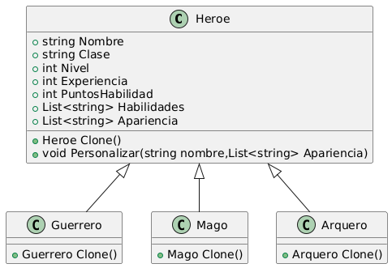

# Problema: Clonación de Personajes en un Videojuego de Aventuras 

Imagina que estás desarrollando un videojuego de aventuras en el que los jugadores pueden controlar a un grupo de héroes con habilidades únicas. Necesitas implementar un sistema de clonación de personajes. Los jugadores deben poder clonar y personalizar héroes existentes para formar equipos estratégicos. 

Requerimientos del sistema: 

  1. Los jugadores deben poder clonar a los héroes existentes en el juego para crear nuevos personajes con habilidades idénticas. 
  2. Cada héroe tiene un conjunto único de habilidades especiales que incluyen ataques, defensas y habilidades mágicas. 
  3. Los heroes pueden pertenecer a diferentes clases, como guerreros, magos o arqueros, y cada clase tiene su propio conjunto de habilidades base. 
  4. Los jugadores deben poder personalizar los nombres y aspectos visuales de los héroes clonados despues de la clonación. 
  5. Los héroes deben mantener un registro de su experiencia, nivel y puntos de habilidad, y esta información debe copiarse correctamente al clonar un héroe. 
  6. El sistema debe ser eficiente y permitir la creación de múltiples clones de un mismo héroe sin duplicar innecesariamente los datos.

  ## Patrón Seleccionado
  Se decide seleccionar el patron Prototype debido a "...es un patrón de diseño creacional que nos permite copiar objetos existentes sin que el código dependa de sus clases.".
  Lo anterior se acomoda a los requerimientos expresados en el problema.

  ## Diagrama

  
