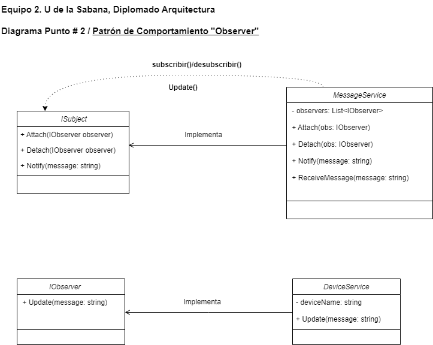

# Problema: Punto # 2 Empresa de Mensajería 

La empresa está desarrollando una aplicación de mensajería en tiempo real que permite a los usuarios comunicarse desde múltiples dispositivos. Cada vez que un usuario recibe un nuevo mensaje, todos los dispositivos del usuario deben ser notificados para que el mensaje se muestre en cada uno de ellos. Para mantener la flexibilidad y desacoplar la lógica de notificación de la aplicación principal.
El patrón que escoja deberá permitir

Notificación en Tiempo Real: Cada dispositivo del usuario debe recibir una notificación cuando llegue un nuevo mensaje.

Desacoplamiento: La aplicación de mensajería debe poder notificar a cualquier número de dispositivos sin saber detalles específicos sobre cada uno de ellos.

Flexibilidad: Los dispositivos pueden ser añadidos o eliminados en tiempo de ejecución sin necesidad de modificar la lógica principal de la aplicación

  ## Patrón Seleccionado
  # Observer
  El patrón Observer es el indicado cuando se requiere:
  
  Notificar en tiempo real a múltiples “interesados” u “observadores” de un cambio en el estado de un objeto.
  Desacoplar la lógica principal de la aplicación (la parte que genera el evento o el cambio) de la lógica específica de cada receptor de la notificación.
  Flexibilidad para agregar o eliminar observadores en tiempo de ejecución sin necesidad de alterar la clase principal que emite las notificaciones.

  ## Diagrama

  

