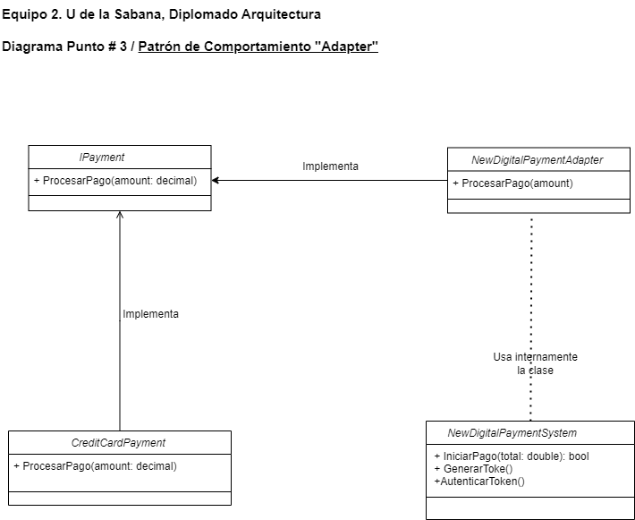

# Problema: Punto # 3 Empresa de Mensajería 

Imagina que estás desarrollando una plataforma de comercio electrónico y deseas ofrecer a tus clientes múltiples opciones de pago, incluyendo tarjetas de crédito, PayPal y un nuevo sistema de pago digital que acaba de ser lanzado. Sin embargo, este nuevo sistema de pago tiene una interfaz incompatible con tu plataforma existente, lo que dificulta su integración.
Tu solución debe permitir lograr una integración suave y coherente del nuevo sistema de pago en tu plataforma de comercio electrónico, sin tener que modificar la lógica interna de tu sistema existente. Para facilitar la adopción de nuevas tecnologías y sistemas en tu aplicación sin interrumpir su funcionalidad principal.

  ## Patrón Seleccionado
  # Adapter
 Se selecciona el patrón Adapter para resolver el problema planteado, ya que este patrón permite que interfaces incompatibles trabajen juntas. 
 En este caso, el sistema de pago digital es incompatible con la plataforma de comercio electrónico, 
 por lo que se necesita un adaptador que permita que ambos sistemas trabajen juntos sin tener que modificar la lógica interna de la plataforma 
 de comercio electrónico.

  ## Diagrama

  
