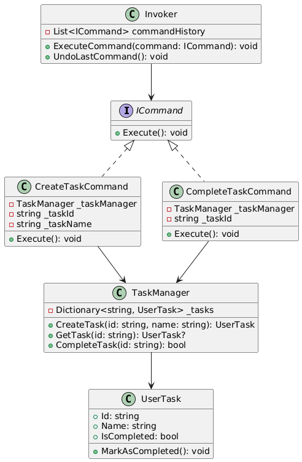

# Patrones

## 4. Sistema de Gestión de Tareas
Contexto:
Imagina un sistema de gestión de tareas en el que los usuarios pueden crear, editar, eliminar y completar tareas. Cada acción realizada por el usuario corresponde a una acción que debe ser ejecutada. Además, es importante mantener un registro de todas las acciones realizadas para permitir la reversión de las mismas si es necesario.

Aplicación del Patrón:
En este escenario, el patrón será aplicado para encapsular cada una de las acciones que el usuario puede realizar sobre una tarea. 

El patrón que seleccione debe tener los siguientes beneficios:
- Desacopla el invocador de los objetos que realizan las acciones.
- Permite la extensión de nuevas operaciones sin modificar el código existente.
- Facilita el registro de acciones para realizar operaciones de reversión.

## Justificación 
**Propósito Patrón Command:**

"Command es un patrón de diseño de comportamiento que convierte una solicitud en un objeto independiente que contiene toda la información sobre la solicitud. Esta transformación permite parametrizar los métodos con diferentes solicitudes, retrasar o poner en cola la ejecución de una solicitud y soportar operaciones que no se pueden realizar."

**¿Por qué se elegío el Patrón Command?**

Porque ayuda a desacoplar el código, hacer el sistema más flexible y permitir funcionalidades como deshacer.

- Desacopla quien solicita una acción de quien la ejecuta.

- Permite deshacer acciones mas fácil.

- Hace el código más flexible y extensible.

- Facilita agregar nuevas operaciones sin modificar código existente.

**Ejemplo de acciones que se pueden agregar** 
- Editar tarea,	Modificar el nombre de una tarea,	**EditTaskCommand	---> EditTask(id, newName)**

- Reabrir tarea,	Marcar una tarea completada como pendiente,	**ReopenTaskCommand	---> ReopenTask(id)**

- Asignar usuario,	Asignar una tarea a un usuario específico,	**AssignUserCommand	---> AssignUserToTask(id, userId)**

**Si se llama directamente a TaskManager.CreateTask() o TaskManager.CompleteTask(), tendríamos estos problemas:**

- Cada acción está directamente ligada a TaskManager, lo que dificulta modificarlo y el codigo que da muy acoplado.

- No se puede deshacer acciones fácilmente.

- Dificultad para agregar nuevas acciones.

---
## Diagrma de Clases

